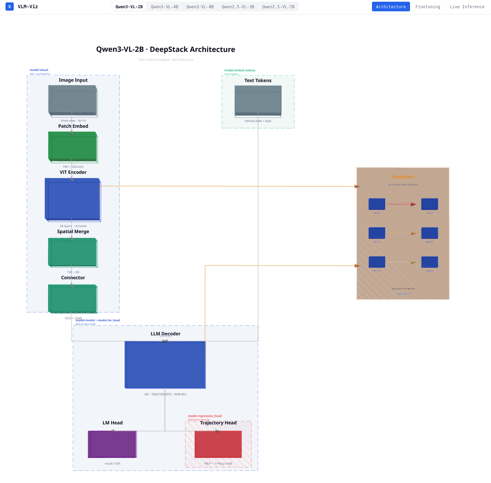
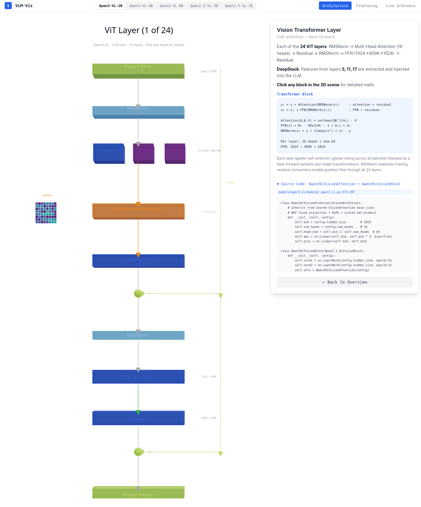
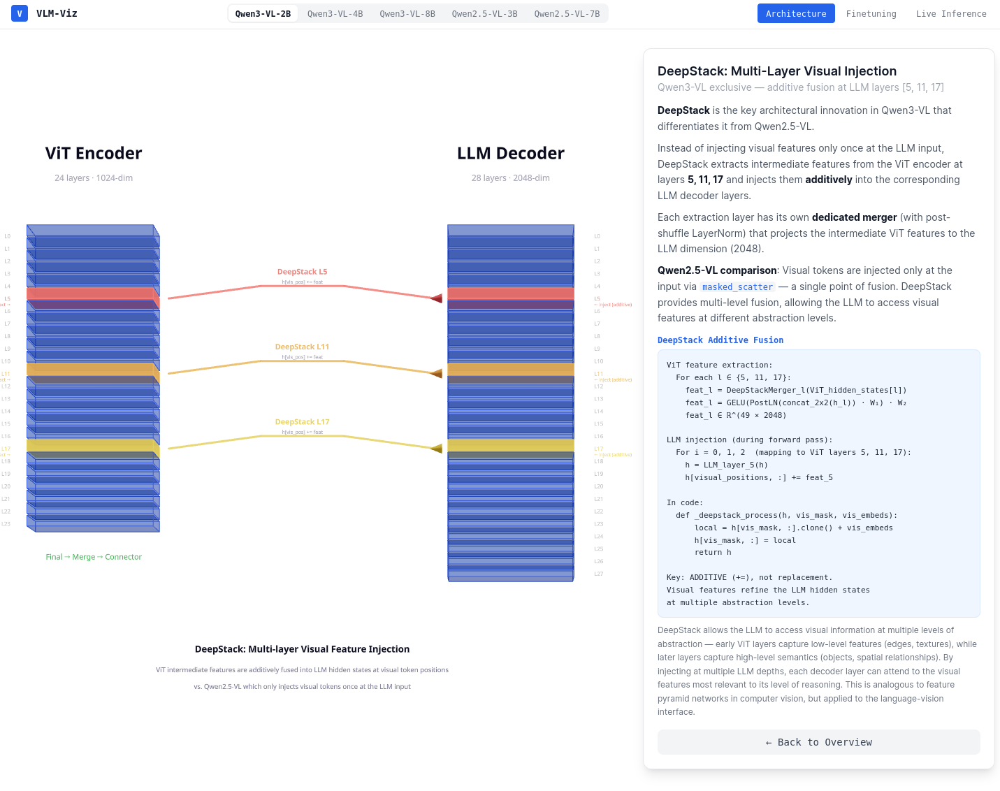
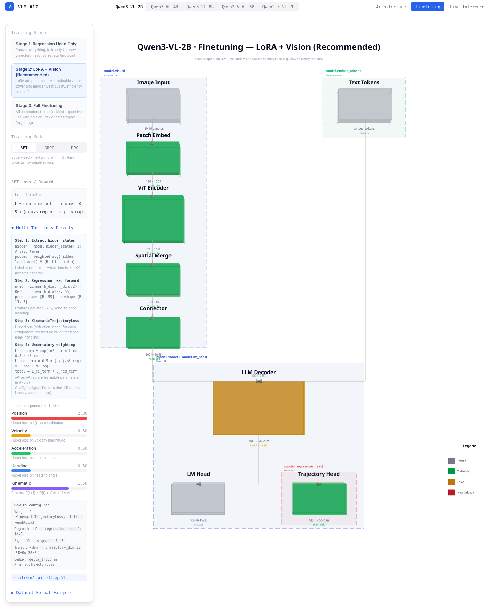

# VLM-Viz: Interactive Vision-Language Model Visualization

An interactive 3D visualization tool for exploring **Qwen3-VL** and **Qwen2.5-VL** Vision-Language Model architectures, built for autonomous driving trajectory prediction research.

## Overview



The tool shows the complete VLM pipeline as an interactive 3D diagram. Click any module to zoom in and explore its internal architecture, mathematical principles, and source code.

**Supported models**: Qwen3-VL-2B, 4B, 8B | Qwen2.5-VL-3B, 7B — switch instantly with the model selector in the header.

## Features

- **Interactive 3D pipeline** — clickable blocks with zoom-in detail views
- **Multi-model comparison** — 5 model variants with auto-updating parameters
- **Two pipeline layouts** — DeepStack (Qwen3-VL) vs Standard Concatenation (Qwen2.5-VL)
- **Clickable sub-components** — drill into RMSNorm, Q/K/V, Attention, SwiGLU, etc.
- **Mathematical formulas** — every module includes its math principle + intuition
- **Source code snippets** — actual PyTorch code from your local `transformers` installation
- **Finetuning guide** — 3 training stages, LoRA config, loss breakdowns, dataset formats
- **Live inference** — upload images, visualize attention + trajectory output (optional)

## Architecture Explorer

Click any block in the pipeline to see its detailed 3D visualization with mathematical explanations.

### ViT Layer Detail



Each sub-component is clickable. The right panel shows:
- **Description** of the component's role
- **Mathematical formula** (e.g., `RMS(x) = √(1/n · Σᵢ xᵢ²)`)
- **Intuition** explaining why this operation matters
- **PyTorch implementation** from the actual model source

### DeepStack (Qwen3-VL Exclusive)



**DeepStack** is the key architectural difference between Qwen3-VL and Qwen2.5-VL:

| | Qwen3-VL (DeepStack) | Qwen2.5-VL (Standard) |
|---|---|---|
| **Visual injection** | Multi-layer additive fusion | Single-point at LLM input |
| **Mechanism** | `h[vis_pos] += vit_features` | `masked_scatter` replacement |
| **Extraction layers** | ViT layers 5, 11, 17 (or 8, 16, 24) | None |
| **QK-Norm** | Yes (RMSNorm on Q, K after projection) | No |

Click the DeepStack panel in the overview to see the two-tower visualization with detailed math.

## Finetuning Guide



The Finetuning tab shows which model components are trainable at each stage:

| Color | Status | Meaning |
|-------|--------|---------|
| Gray | Frozen | Parameters not updated |
| Green | Trainable | Full gradient updates |
| Orange | LoRA | Low-rank adapters only |
| Red | New | Added during finetuning |

### Training Stages

| Stage | Strategy | Trainable Components |
|-------|----------|---------------------|
| **1** | Head Only | Regression head only (safest) |
| **2** | LoRA + Vision (Recommended) | LoRA on LLM (r=128, α=256) + vision tower + merger + head |
| **3** | Full Finetuning | All parameters (risk of catastrophic forgetting) |

### Training Modes

- **SFT** — Multi-task loss: CE (language) + kinematic trajectory loss (position, velocity, acceleration, heading, physics consistency) with learned uncertainty weighting
- **GRPO** — Group Relative Policy Optimization: 5 reward functions (format 0.10, ADE 0.35, FDE 0.25, physics 0.15, safety 0.15)
- **DPO** — Direct Preference Optimization: learns from chosen/rejected trajectory pairs (β=0.1)

Each mode shows step-by-step pipeline details, loss component weights, configuration instructions, and dataset format examples.

## Supported Models

| Model | ViT Depth | ViT Dim | LLM Layers | LLM Dim | GQA | DeepStack |
|-------|-----------|---------|------------|---------|-----|-----------|
| Qwen3-VL-2B | 24 | 1024 | 28 | 2048 | 16Q/8KV | [5, 11, 17] |
| Qwen3-VL-4B | 24 | 1024 | 36 | 2560 | 32Q/8KV | [5, 11, 17] |
| Qwen3-VL-8B | 27 | 1152 | 36 | 4096 | 32Q/8KV | [8, 16, 24] |
| Qwen2.5-VL-3B | 32 | 1280 | 36 | 2048 | 16Q/2KV | — |
| Qwen2.5-VL-7B | 32 | 1280 | 36 | 2048 | 16Q/2KV | — |

## Quick Start

### Prerequisites

- Node.js 18+ / npm 10+

### Installation & Run

```bash
cd /path/to/vlm-viz
npm install
npm run dev
```

Open `http://localhost:3000` (or `http://<your-ip>:3000` for SSH remote access).

### Live Inference Backend (Optional)

```bash
conda activate iros
cd /path/to/vlm-viz
uvicorn backend.main:app --reload --port 8000
```

Requires the finetuned Qwen3-VL checkpoint. The Architecture and Finetuning tabs work without it.

## Usage

### Architecture Tab

1. **Select a model** from the header bar
2. **Click any pipeline block** to zoom into its detail view
3. Inside ViT/LLM detail views, **click sub-blocks** (RMSNorm, Q/K/V, Attention, FFN) for:
   - Mathematical formula + intuition
   - PyTorch source code
4. **Click the attention matrix** for score pattern / causal mask explanation
5. **Orbit**: left-drag to rotate, scroll to zoom, right-drag to pan
6. **"Back to Overview"** returns to the pipeline view

### Finetuning Tab

1. Select **Training Stage** (1/2/3) — blocks change color by status
2. Select **Training Mode** (SFT/GRPO/DPO) — loss breakdown updates
3. **Click any block** for LoRA config, LR, source file paths
4. Expand **"Multi-Task Loss Details"** or **"Dataset Format"** for full details

## Project Structure

```
vlm-viz/
├── src/
│   ├── app/                        # Next.js pages
│   │   ├── walkthrough/            # Architecture tab
│   │   ├── finetuning/             # Finetuning tab
│   │   └── live/                   # Live Inference tab
│   ├── components/scene/           # 3D visualizations
│   │   ├── overview/               # Pipeline + DeepStack
│   │   ├── vit/                    # ViT layer detail
│   │   ├── llm/                    # LLM layer detail
│   │   ├── head/                   # Trajectory head
│   │   └── primitives/             # TensorBlock, FlowArrow, etc.
│   ├── scene/                      # Configuration
│   │   ├── modelConstants.ts       # 5 model architectures
│   │   ├── subBlockInfo.ts         # Math formulas per component
│   │   ├── codeSnippets.ts         # PyTorch code per module
│   │   └── finetuningConfig.ts     # Training stages + losses
│   └── store/                      # Zustand state
├── backend/                        # FastAPI inference server
└── docs/                           # Screenshots
```

## Tech Stack

Next.js 14 · TypeScript · Three.js · @react-three/fiber · Tailwind CSS · Zustand · Framer Motion · FastAPI

## Related

- [VLM_trajectory_generation](../VLM_trajectory_generation/) — The finetuning codebase this tool visualizes
- [Qwen3-VL](https://huggingface.co/Qwen/Qwen3-VL-2B-Instruct) · [Qwen2.5-VL](https://huggingface.co/Qwen/Qwen2.5-VL-3B-Instruct)
- Inspired by [bbycroft/llm-viz](https://bbycroft.net/llm)
